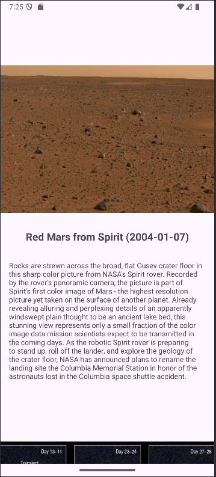

# AND101 Project 6 - CYOAPI Part 2: RecyclerView Edition

Submitted by: **Suritaneil Sahota**

Time spent: **3** hours spent in total

## Summary

**NASA APOD** is an android app that **displays Astronomy Pictures of the Day (along with the title, date, and explanation). The app allows user to scroll to diffferent pictures from the NASA APOD API")**

## Application Features

The following REQUIRED features are completed:

- [x] Make an API call to an API of your choice using AsyncHTTPClient
- [x] Implement a RecyclerView to display a list of entries from the API
- [x] Display at least three (3) pieces of data for each RecyclerView item

The following STRETCH features are implemented:

- [ ] Add a UI element for the user to interact with API further
- [ ] Show a `Toast` or `Snackbar` when an item is clicked
- [ ] Add item dividers with `DividerItemDecoration`

The following EXTRA features are implemented:

- [ ] List anything else that you added to improve the app!

## Video Demo

Here's a video / GIF that demos all of the app's implemented features:

GIF created with **screenToGif**

## Notes

Here's a place for any other notes on the app, it's creation process, or what you learned this unit!

## License

Copyright **2025** **Suritaneil Sahota**

Licensed under the Apache License, Version 2.0 (the "License");
you may not use this file except in compliance with the License.
You may obtain a copy of the License at

    http://www.apache.org/licenses/LICENSE-2.0

Unless required by applicable law or agreed to in writing, software
distributed under the License is distributed on an "AS IS" BASIS,
WITHOUT WARRANTIES OR CONDITIONS OF ANY KIND, either express or implied.
See the License for the specific language governing permissions and
limitations under the License.
